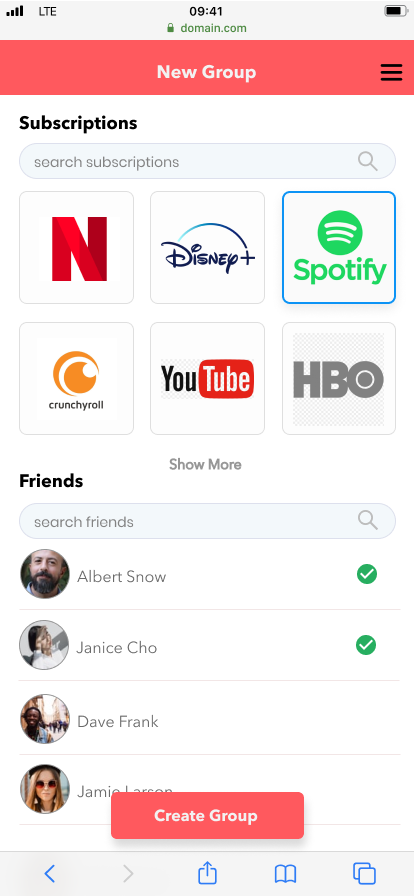
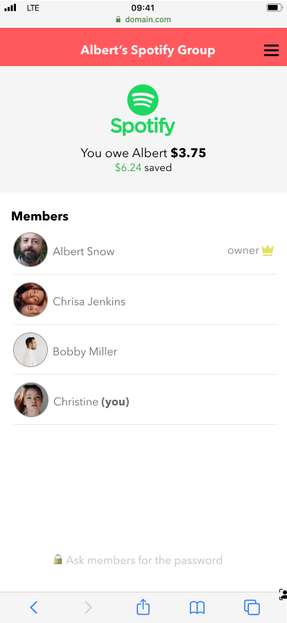
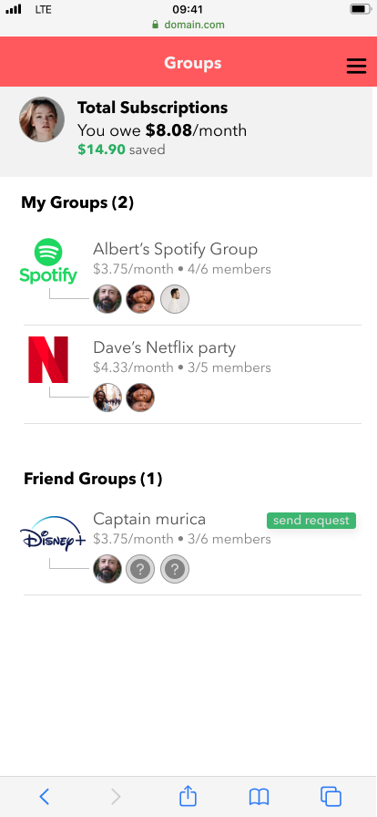

This is part 1 of the [Open Projects](/open-projects) Series.

### Motivation

There’s dozens of subscription services, and we don’t want to subscribe to a new service for just that one show we want[^1]. With Netflix, Prime Video, additions of  Disney+ and Apple TV+ in late 2019 and the recent short form video subscription app Quibi, there are more streaming platforms than ever. It’s like invasion of electric scooters again[^2].

Even with our extra free time recently, for most of us subscribing to yet another service is too much investment for too little value. As much as we want the option to watch the Avengers on Disney+, Dave Chapelle on Netflix, The Expanse on Amazon Prime, Westworld on HBO, and Vinland Saga on Funimation, it’s probably not worth paying $50 a month for.

42% of consumers would consider subscribing to a new service[^3], with 87% saying that they’re too expensive. In other words, they just need a nudge with a little help from their friends.

### Solution: Share with Friends!

It’s good to have friends, especially those that let you leech of their disney+ account, because you wouldn’t want anyone to know about your latest Netflix binges. Spotify has a separate family plan, so you don’t see what others in the same plan listen to. Still, there has to be some trust. Not everyone in your facebook / instagram are your actual friends, but it’s a good start. It worked for Tinder so it’ll work for something more or less steamy as subscription services.

Sharing with friends lets you enjoy a full subscription at partial price without infringing copyright. After all, friends are like extended family. With the guise of being under the same roof, most services tolerate password sharing and several simultaneous stream, within reason. A caveat is that sharing passwords is very insecure, so one must use unique, randomly generated passwords and not use the same password anywhere else.

### Design

| 
New Group
 | 
Group Details
 | 
My Groups
 |
|:--------------------:|:--------------------:|:--------------------:|
|  |  |  |

Similar to [splitwise's](https://www.splitwise.com) UI, users can create groups with prebuilt or custom subscription services, add their friends and family, and see how much they owe the group owner every month. If a group is public (to mutual friends), the friend could request an invitation. This could get murky because not everyone in the group may want to welcome a new member. Of course, It's something members should discuss in person, but this may be too much communication for 2020.

### Open Questions

* How much do you trust your friends with a common password?
* How to request to join a friends’ account? If the new member is not a mutual friend with everyone else, they wouldn't be comfortable sharing passwords.

[^1]: [justwatch.com](http://justwatch.com) shows which services stream any given movie\
[^2]: <https://www.vox.com/2018/8/27/17676670/electric-scooter-rental-bird-lime-skip-spin-cities>\
[^3]: <https://www.mesaeurope.org/wp-content/uploads/2019/10/Mediamorph-29102019.pdf>

